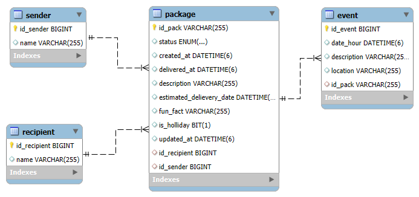
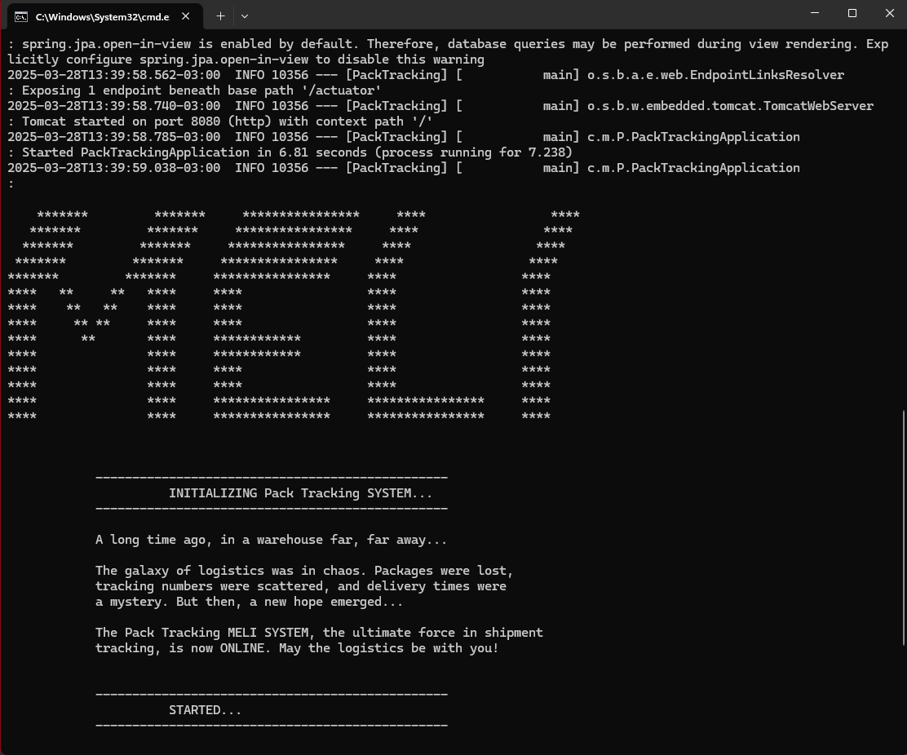

 
<h1>Pack Tracking MELI</h1> 

> Status do Projeto: :heavy_check_mark: Concluído

### Tópicos 

:small_blue_diamond: [Descrição do projeto](#descrição-do-projeto)

:small_blue_diamond: [Modelagem do banco de dados](#modelagem-do-banco-de-dados)

:small_blue_diamond: [Escalabilidade e otimização](#escalabilidade-e-otimização)

:small_blue_diamond: [Pré-requisitos](#pré-requisitos-warning)

:small_blue_diamond: [Como rodar a aplicação](#como-rodar-a-aplicação-arrow_forward)

:small_blue_diamond: [EndPoints](#endpoints-gear)

:small_blue_diamond: [Possiveis melhorias](#possiveis-melhorias-hammer_and_wrench)

## Descrição do projeto 

<p align="justify">
   A aplicação fornece APIs RESTful para manipular dados de pacotes e eventos de rastreamento, com foco em performance, escalabilidade, e resiliência.
</p>

## Modelagem do banco de dados

<p align="justify">
   Versão do MySQL: Server version: 8.0.41 MySQL Community Server - GPL

   Diagrama MER:
</p>



## Escalabilidade e otimização

:heavy_check_mark: Utilizado @Async do Spring que permite que operações demoradas (I/O, chamadas externas, processamento pesado) rodem em threads separadas, liberando a thread principal para continuar processando outras requisições no endpoint de envio de eventos de rastreamento por conta da alta demanda que ele ira receber.  

:heavy_check_mark: Utiliza eTags nos cabeçalhos Http de alguns endpoints para evitar geração repetida da mesma página, melhorando a performance e reduzindo requisições ao backend.  

:heavy_check_mark: Utiliza HikariCP para gerenciar conexões com o banco de dados de forma eficiente:  

:heavy_check_mark: Utiliza paginacao configuravel no serviço agendado com @Scheduled de expurgo de dados para não onerar demais o processamento 

:heavy_check_mark: Utiliza SLF4J para gestão de logs 

## Pré-requisitos :warning:

:heavy_check_mark: Java version "21.0.6" 2025-01-21 LTS [download](https://www.oracle.com/br/java/technologies/downloads/)

:heavy_check_mark: Apache Maven 3.9.9 [download](https://maven.apache.org/docs/3.9.9/release-notes.html)

:heavy_check_mark: 8.0.41 MySQL Community Server - GPL [download](https://dev.mysql.com/downloads/mysql/8.0.html)


## Como rodar a aplicação :arrow_forward:

:heavy_check_mark: Instalar o Java, MySQL e o Maven indicados nos pré-requisitos.

:heavy_check_mark: Criar o banco de dados de nome "pack_tracking_bd" configurado para rodar o padrão do Mysql (localhost:3306). Caso seja necessario trocar o nome e/ou endereço do banco de dados será necessario atualizar a configuração no arquivo application.properties antes de compilar o projeto.

:heavy_check_mark: Clonar o projeto do git.

(Obs: Por padrão a aplicação vai subir na porta 8080, caso seja necessario alterar será necessario indicar no application.properties a configuração server.port=8081)

(Obs: O serviço de expurgo de dados para pacotes que foram cancelados está configurado via application.properties para rodar a cada 2 horas, caso sejar altere a propriedade scheduler.cancelled.packages.cron.expression antes de compilar o projeto).

:heavy_check_mark: Após via cmd/terminal/prompt vá ao diretório raiz do projeto (nível do arquivo pom.xml) e execute o comando maven:
```bash
 mvn clean package
```
No diretório raiz será criada a pasta target, nela é gerado o arquivo PackTracking-1.0.jar, este é o executável. 

(Obs: certifique-se de não ter aberto o diretório "target" em nenhum terminal ou janela, esse diretório sempre é apagado no clean, então se ele estiver aberto o S.O. pode negar permissão e falhar o comando "mvn clean package")

:heavy_check_mark: Para executar o PackTracking-1.0.jar rodar o comando via cmd/terminal/prompt
```bash
java -jar PackTracking-1.0.jar
```

O Programa vai iniciar e deve exibir o cmd indicando que a aplicaçãosubiu com sucesso da seguinte forma:



A aplicaçõe estara inicializada e pronta para receber solicitações.

(Obs: O Arquivos de log packTracking.log será gerado no mesmo nivel de diretorio de execução do jar dentro do diretorio /logs)

## EndPoints :gear:

JSONs esperados nas entradas dos endPoints (Para facilitar testes via Postman)
Os endPoints utilizam If-None-Match nos headers

:heavy_check_mark: /package/savePack

Neste endPoint foram retirados os campos "funFact" e "isHoliday" da request pois os dois são obtidos via APIs externas no momento de processamento, por tanto não faz sentido espera-los na request
```Json
{
 "description": "Pacote recebido no centro de distribuição",
 "sender": "Loja do zé",
 "recipient": "Fulana da Silva",
 "estimatedDeliveryDate": "2025-05-27T24:00:00Z"
}
```

:heavy_check_mark: /package/updatePackStatus/{id}

```Json
{
 "status": "IN_TRANSIT"
}
```
:heavy_check_mark: /event/sendEvent

Neste enPoint o uso de If-None-Match no header é obrigatorio (pensando em evitar oneração por possiveis rotinas de retry do front-end)
```Json
 {
 "packageId": "pack-20250327223356013",
 "location": "Aguardando novo transito",
 "description": "Pacote em transito",
 "date": "2025-01-22T11:00:00Z"
}
```

:heavy_check_mark: /package/getPackageDetails/{id}?includeEvents=true

> Não necessita de Body pois parametriza na URL

:heavy_check_mark: /package/cancelPackage/{id}

> Não necessita de Body pois parametriza na URL

:heavy_check_mark: /package/getListPackage?sender=&recipient=
> Não necessita de Body pois parametriza na URL


## Possiveis melhorias :hammer_and_wrench:

:heavy_check_mark: Implementar cache do spring nos endPoints de consultas de pacotes

:heavy_check_mark: Implementar expurgo de dados para pacotes com status DELIVERED

:heavy_check_mark: Incluir testes automatizados via JUnit para validar comunicação com APIs externas como a Dogapi e a Nager Date.

:heavy_check_mark: Incluir testes automatizados de carga com JMeter.

:heavy_check_mark: Atualmente é possivel configurar o intervalo de tempo e a quantidade de dados a serem expurgados pelo servico de expurgo de dados, porem essa configuracao é via application.properties, o que acaba limitando um pouco o uso dessa configuração, então seria interessante essa configuração ficar fora do executavel da aplicação, lendo de um arquivo externo ou do proprio banco de dados.


Copyright :copyright: 2025 - PackTracking
